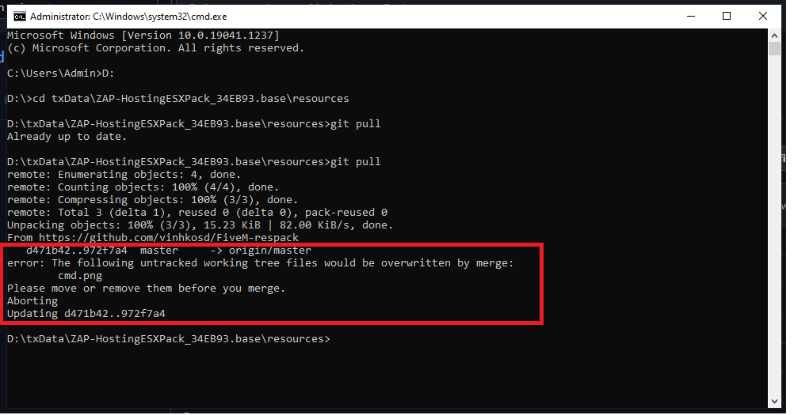

"# FiveM-respack" 
#### 1. Cách cài đặt:
thêm dòng ```exec resources/resources.cfg```
vào server.cfg tại thư mục txData để server nhận resource config
*DEMO: *
[](huong_dan1.png)

### 2. Cách up tệp đã sửa lên github
- mở cmd và trỏ tới thư mục resource -> Windows + R
- gõ cd tới thư mục txData, nếu file nằm ổ đĩa khác C thì gõ drive letter
ví dụ 

 ```D:```

sau đó enter
tiếp đến gõ lệnh ```cd [đường_dẫn_tới_thư_mục]```
*Demo*
[](cmd.png)

B1. ```git pull``` để lấy source mới nhất về
[](gitpull.png)
 - trường hợp bị conflict như hình (file từ github và file trên máy không đồng nhất - thường là 2+ người sửa cùng lúc 1 file sẽ bị như thế này) thì liên hệ mình (Vinh) để hỗ trợ ghép code 2+ người lại nhé
 [](conflict.png)
 B2. ```git status``` để xem những thay đổi của file. ở dưới hình những file có màu đỏ là những file đã thay đổi/tệp mới
  [](gitstatus.png)
  B3. ```git add [địa_chỉ/tên_file]``` để add từng file hoặc ```git add .``` để thêm tất cả, nếu không báo gì có nghĩa là git add thành công, có thể ```git status``` để kiểm tra nếu không chắc chắn
   [](gitadd.png)
   [](gitstatusadd.png)
B4. ```git commit -m "[tên_commit]"``` để đóng gói lại các file đã add, có thể đặt tên commit tuỳ thích hoặc đặt theo tính năng để mọi người có thể hiểu 1 commit mình đã làm gì
[](gitcommit.png)
B5. ```git push``` để up file lên github
- nếu up lên bị lỗi như thế này có nghĩa là file đã không đồng nhất với cloud, quay lại bước 1 để cập nhật code nhé
[](gitpusherr1.png)
- đây là ví dụ 1 commit được push thành công
[](gitpush.png)
**Nếu gặp trường hợp lỗi nào không giống như trên ảnh thì liên hệ mình (Vinh) để fix lỗi update code nhé. Chúc các anh em code vui vẻ**